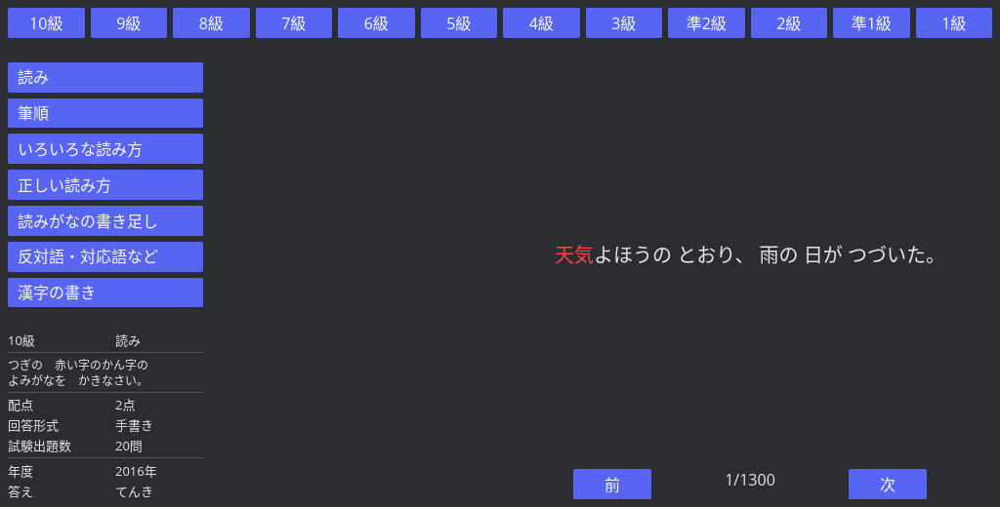
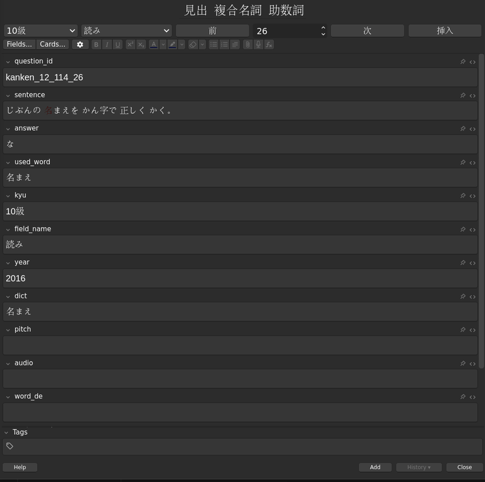

# kanken-rs

A personal toolchain for studying Japanese kanji using question data from the Nintendo Switch game 漢検スマート対策 (Kanken Smart).

This project is strictly for personal use. The question data originates from a legally owned game cartridge and is not for distribution.

## Notice

This project started as a curiosity-driven reverse engineering exercise.  
It is NOT intended to support piracy or circumvent copy protection.  
Please buy the game directly to support the developer.

## What's included

### parser
A Rust crate that parses Unity IL2CPP binary assets extracted from the cartridge into structured Rust types. Produces `combined_fields.json` — the shared data source used by the browser and the Anki addon.

### kanken-browser
A desktop question browser built with [iced](https://github.com/iced-rs/iced) 0.14. Browse all 75,848 questions across 12 kyu levels and 120 question fields. Target words are highlighted in red.


### kanken_anki
An Anki addon that pre-fills flashcard fields directly from the question bank. Auto-advances after adding a card, and auto-copies sentence translations when consecutive questions share the same sentence.

## Data extraction

The following files are required to produce `combined_fields.json`:

1. Dump XCI from your Nintendo Switch cartridge
2. Extract the RomFS NCA using [hactool](https://github.com/SciresM/hactool) with your `prod.keys`
3. Copy `kanken_field_master.csv` from `romfs/Data/StreamingAssets/`
4. Open `romfs/Data/resources.assets` in [UABEA](https://github.com/nesrak1/UABEA) and export all `KankenQuestionSO_*.dat` MonoBehaviour assets
5. Place all `.dat` files and the CSV in `data/`, then run:

```bash
cargo test dump_combined_fields_to_json
```

This produces `data/combined_fields.json`.
